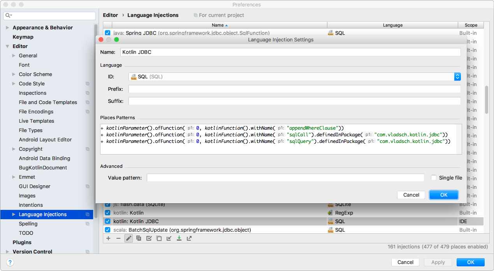
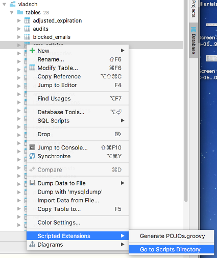
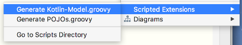
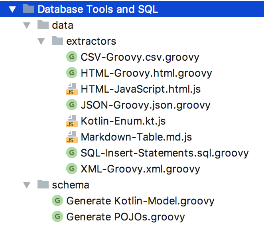

# Kotlin-JDBC

[](https://travis-ci.org/vsch/kotlin-jdbc)
[](https://search.maven.org/#search%7Cga%7C1%7Cg%3A%22com.vladsch.kotlin-jdbc%22)

A light weight library that exposes JDBC API with the convenience of Kotlin and gets out of the
way when it is not needed.

For developers who prefer to have their database access through SQL where they can read it,
validate it and view its query plans instead of working through cumbersome ORM or limited
frameworks which obfuscate SQL with their non-standard cryptic syntax.

Refactored from [KotliQuery](https://github.com/seratch/kotliquery) which is an excellent idea
but for my use I needed to simplify its implementation to make adding functionality easier
without having to create a ton of intermediate classes, add result set to JSON conversion
without intermediate objects, add stored procedure calls with `in`/`inout`/`out` parameters and
ability to process multiple result sets.

Convenient models with simple syntax which are aware of primary key columns, auto generated
columns, columns with defaults and nullable columns. Models protected property `model` to
define properties via `provideDelegate`. See [Convenient Models](#convenient-models)

```kotlin
import java.sql.Timestamp

// dbCase = true if database columns same as properties
// dbCase = false if database columns are snake-case versions of property names
class ValidModel : Model<ValidModel>("tableName", dbCase = true) {
    var processId: Long? by model.auto.key
    var title: String by model
    var version: String by model
    var optional: Int? by model           
    var hasOwnColumnName: Int? by model.column("own_name")           
    var updatedAt: Timestamp? by model.auto
    var createdAt: Timestamp? by model.auto
}
```

If you are using [IntelliJ IDEA](https://www.jetbrains.com/idea/) IDE then defining a Language
Injection for the sql factory functions will automatically apply syntax highlighting,
completions and annotations to the SQL strings passed to `sqlQuery()` and `sqlCall()`, making it
even easier to work with SQL queries. See
[Configuring SQL Language Injections](#configuring-sql-language-injections)

IntelliJ Ultimate Database Tools extension script for conversion of SQL tables to a Model is
also available. See
[Installing IntelliJ Ultimate Database Tools Extension Script](#installing-intellij-ultimate-database-tools-extension-scripts).

The library provides a simple migration command processor to implement migrate/rollback
functionality with version tracking with each version containing a copy of database entities:
functions, procedures, tables, triggers and views. See [Migrations](#migrations)

## Getting Started

#### Maven

```maven
<dependency>
    <groupId>com.vladsch.kotlin-jdbc</groupId>
    <artifactId>kotlin-jdbc</artifactId>
    <version>0.2.26</version>
</dependency>
```

#### Gradle

```gradle
compile "com.vladsch.kotlin-jdbc:kotlin-jdbc:0.2.26"
```

### Example

#### Creating DB Session

`Session` object, thin wrapper of `java.sql.Connection` instance, runs queries, optionally
converts results into instances, lists, hash maps with corresponding json versions as json
objects or json arrays.

```kotlin
import com.vladsch.kotlin.jdbc.*

val session = session("jdbc:h2:mem:hello", "user", "pass") 
```

#### HikariCP

[HikariCP](https://github.com/brettwooldridge/HikariCP) is an excellent choice for connection
pool implementation. It is blazing fast and easy to use.

```kotlin
HikariCP.default("jdbc:h2:mem:hello", "user", "pass")

using(session(HikariCP.dataSource())) { session ->
   // working with the session
}
```

Define default data source for session and use shorter code:

```kotlin
HikariCP.default("jdbc:h2:mem:hello", "user", "pass")
// define default data source factory to allow use of session() for default
Session.defaultDataSource = { HikariCP.dataSource() }

usingDefault { session ->
   // working with the session
}
```

#### DDL Execution

```kotlin
session.execute(
sqlQuery("""
  create table members (
    id serial not null primary key,
    name varchar(64),
    created_at timestamp not null
  )
""")) // returns Boolean
```

#### Update Operations

```kotlin
val insertQuery: String = "insert into members (name,  created_at) values (?, ?)"

session.update(sqlQuery(insertQuery, "Alice", Date())) // returns effected row count
session.update(sqlQuery(insertQuery, "Bob", Date()))
```

#### Select Queries

Prepare select query execution in the following steps:

- Create `SqlQuery` or `SqlCall` object by using `sqlQuery()` or `sqlCall()` factory
- run the query using `session.list` or `session.first` passing it extractor function (`(Row) ->
  A`)

```kotlin
val allIdsQuery = sqlQuery("select id from members")
val ids: List<Int> = session.list(allIdsQuery) { row -> row.int("id") }
```

Extractor function can be used to return any type of result type from a `ResultSet`.

```kotlin
data class Member(
  val id: Int,
  val name: String?,
  val createdAt: java.time.ZonedDateTime)

val toMember: (Row) -> Member = { row -> 
  Member(
    row.int("id"), 
    row.stringOrNull("name"), 
    row.zonedDateTime("created_at")
  )
}

val allMembersQuery = sqlQuery("select id, name, created_at from members")
val members: List<Member> = session.list(allMembersQuery, toMember)
```

```kotlin
val aliceQuery = sqlQuery("select id, name, created_at from members where name = ?", "Alice")
val alice: Member? = session.first(aliceQuery, toMember)
```

#### Named query parameters

Alternative syntax is supported to allow named parameters in all queries.

```kotlin
val query = sqlQuery("""
SELECT id, name, created_at FROM members
WHERE (:name IS NOT NULL OR name = :name) AND (:age IS NOT NULL OR age = :age)
""", mapOf("name" to "Alice"))
```

In the query above, the param `age` is not supplied on purpose.

Performance-wise this syntax is slightly slower to prepare the statement and a tiny bit more
memory-consuming, due to param mapping. Use it if readability is a priority.

This method converts the pattern name to an indexed `?` parameter and is not based on
"artificial" string replacement.

`SqlCall` instances take an additional map of out parameters. The value used for the out
parameter is only significant for its type used when getting the results back. For `inout`
parameters pass the name in both maps.

```kotlin
sqlCall("""call storedProc(:inParam,:inOutParam,:outParam)""",
	mapOf("inParam" to "Alice", "inOutParam" to "Bob"), 
	mapOf("inOutParam" to "", "outParam" to ""))
```

For convenience there are methods to pass parameters as in, inout, out as a list of pairs or
maps:

```kotlin
sqlCall("""call storedProc(:inParam,:inOutParam,:outParam)""")
	.inParams("inParam" to "Alice")
	.inOutParms("inOutParam" to "Bob") 
	.outParams("outParam" to "")
```

However, the first method is fastest because it sets all the parameters with the least run-time
processing.

#### Typed params

In the case, the parameter type has to be explicitly stated, there's a wrapper class -
`Parameter` that will help provide explicit type information.

```kotlin
val param = Parameter(param, String::class.java)
sqlQuery("""select id, name 
    from members 
    where ? is null or ? = name""", 
    param, param)
```

or also with the helper function `param`

```kotlin
sqlQuery("""select id, name 
    from members 
    where ? is null or ? = name""", 
    null.param<String>(), null.param<String>())
```

This can be useful in situations similar to one described
[here](https://www.postgresql.org/message-id/6ekbd7dm4d6su5b9i4hsf92ibv4j76n51f@4ax.com).

#### Working with Datasets

`#forEach` allows you to make some side-effect in iterations. This API is useful for handling a
`ResultSet` one row at a time.

```kotlin
session.forEach(sqlQuery("select id from members")) { row ->
  // working with large data set
})
```

As an alternative when you need to modify a small amount of values or columns, and then pass the
results as JSON to the front-end, you can convert the result set to JSON object or array and
modify the data in place.

This library uses the [`boxed-json`](https://github.com/vsch/boxed-json) library's
`MutableJsObject` and `MutableJsArray` which allow modifications to the `JsonValue`s without
having to copy the object.

#### Transactions

`Session` object provides transaction block. Transactions are automatically committed if not
explicitly committed or cancelled inside the block. Any uncaught exceptions will cause the
transaction to be automatically rolled back.

The `Transaction` instance is a session with added `java.sql.Connection` transaction methods for
convenience.

```kotlin
session.transaction { tx ->
  // begin
  tx.update(sqlQuery("insert into members (name,  created_at) values (?, ?)", "Alice", Date()))
}

session.transaction { tx ->
  // begin
  tx.update(sqlQuery("update members set name = ? where id = ?", "Chris", 1))
  throw RuntimeException() // rollback
}
```

#### Queries

SQL queries come in two forms: `SqlQuery` for all DDL and DML. `SqlCall` is for calling stored
procedures with in/inout/out parameters to pass to the procedure and processing inout/out
parameters after execution with optional processing of multiple result sets returned by the
procedure.

All queries are executed through the `Session` instance or its sub-class `Transaction`. The
session has separate methods for different types of query execution and results:

* `session.query` used to execute queries and processing a result set
* `session.execute` used to execute queries not expecting a result set
* `session.update` used to execute update queries

Convenience methods that process result sets which use an extractor which take a ResultSet Row
and return an instance of something:

* `session.list` used to return a list of extracted data from rows
* `session.first` used to return a single instance from head of result set
* `session.count` used to return the count of rows when you don't need more than that and are
  too lazy to write a count query
* `session.hashMap` same as list but used to return a hash map keyed on column(s) from the
  result set
* `session.jsonArray` same as list but returns an array of `JsonObjects` holding each row data
* `session.jsonObject` same as `hashMap` except the `JsonObject` first level properties are a
  string of the keyed column(s) from each row.

Iteration helpers which will invoke a consumer for every row of result set data:

* `session.forEach` to iterate over each row or a result set from an `SqlQuery` or `SqlCall`
* `session.forEach` to iterate over each result set from a `SqlCall` and to process inout/out
  parameters.

Update and getting generated key(s):

* `session.updateGetId` to execute an update query and get the first column of the first row of
  the generated keys result set and return its integer value
* `session.updateGetIds` to execute an update query and get the first column of all the rows of
  the generated keys result set and return a list of integers
* `session.updateGetKey` to execute an update query and get the keys (using an extractor) of the
  first row of the generated keys result set and return its value
* `session.updateGetKeys` to execute an update query and get the keys (using an extractor) of
  all the rows of the generated keys result set and return them as a list

#### Convenient Models

A base `Model` class can be used to define models which know how to set their properties from a
`Row` result set row, from other Models, understand `auto` generated, `key` columns and columns
with `default` values; can generate `INSERT`, `UPDATE`, `DELETE` and `SELECT` queries for a
model instance with validation of required fields and minimal required columns for an update.

Using these models is a convenience not a requirement since it does create overhead by building
the model's properties for every instance.

* Define model's properties by using `by model`. The nullability of the property type dictates
  whether the property can be omitted or set to null
* Key properties by: `by model.key`. These will be used for `WHERE` list for `UPDATE`, `DELETE`
  or `SELECT` for reload query generation
* Auto generated (left out of update and insert column list) properties by: `by model.auto`
* Auto generated Key (key column and auto generated) by: `by model.key.auto`, `by model.autoKey`
  or `by model.auto.key`
* Columns which have default values by: `by model.default`. These won't raise an exception for
  `INSERT` query generation if they are missing from the model's defined property set. A
  function alternative `by model.default(value)` will provide a default value which will be used
  for insert query if an explicit value is not provided for the property.

If column names are the same as the property names then set `dbCase = true` for the `Model`
constructor argument. If column names are snake-case versions of camelcase property names
(lowercase with underscores between words) then set `dbCase = false` and the model will generate
correct column names automatically. When needed, you can provide a column name explicitly via
`.column("columnName")` making it independent of the property name. This function is available
on any delegate provider so it can be combined with key, auto and default properties: `model`,
`model.key`, `model.auto`, `model.default`

By default models allow public setters on properties marked `auto` or `autoKey`. To add
validation forcing all `auto` properties to have no `set` method or have `private set` pass
`false` for `allowSetAuto` second parameter to model constructor.

Any property marked as `auto` generated will not be used in `UPDATE` or `INSERT` queries.

For IntelliJ Ultimate a Database extension script can be installed which will generate models
from the context menu of any table in the database tools window. See
[Installing IntelliJ Ultimate Database Tools Extension Script](#installing-intellij-ultimate-database-tools-extension-scripts)

```kotlin
class ValidModel : Model<ValidModel>(tableName, dbCase = true) {
    var processId: Long? by model.auto.key
    var title: String by model
    var version: String by model
    var batch: Int? by model.default(1)
    var updatedAt: String? by model.auto
    var createdAt: String? by model.auto
    
    companion object {
        // convenience method for creating new instances from result set row
        val toModel: (Row) -> ValidModel = { row ->
            ValidModel().load(row)
        }
        
        val tableName = "tableName"
    }
}

fun useModel() {
    using(session(HikariCP.default())) { session ->
        val modelList = session.list("", ValidModel.fromRow)
        
        val model = ValidModel()
        model.title = "title text"
        model.version = "V1.0"
        
        // execute an insert and set model's key properties from the keys returned by the database
        // batch will be set to 1 since it is not set in properties
        model.insert(session)
        
        // this will delete the model and clear auto.key properties
        model.delete(session) 
        
        // this will delete the model but not clear auto.key properties
        model.deleteKeepAutoKeys(session) 
        
        // execute select query for model (based on keys) and load model
        model.select(session)
        
        // just insert, don't bother getting keys
        model.insertIgnoreKeys(session)
        
        // take a snapshot of current properties
        model.snapshot()
        model.version = "V2.0"
        
        // will only update version since it is the only one changed, does automatic snapshot after update
        model.update(session)
        
        // will only update version since it is the only one changed but will reload model from database 
        // if updatedAt field is timestamped on update then it will be loaded with a new value
        model.version = "V3.0"
        model.updateReload(session)
    }
}
```

### IntelliJ Configuration

#### Configuring SQL Language Injections

You can manually add `@Language("SQL")` annotation to strings or add a language injection
configuration:

The places patterns text is:

```
+ kotlinParameter().ofFunction(0, kotlinFunction().withName("sqlCall").definedInPackage("com.vladsch.kotlin.jdbc"))
+ kotlinParameter().ofFunction(0, kotlinFunction().withName("sqlQuery").definedInPackage("com.vladsch.kotlin.jdbc"))

```



To get full benefit of SQL completions you should also define a database source to the database
against which you are developing (or a local clone of it) and configure the SQL dialect for the
database you are using.

#### Installing IntelliJ Ultimate Database Tools Extension Scripts

Download the groovy script for generating a `kotlin-jdbc` model:
[Generate Kotlin-Model.groovy](extensions/com.intellij.database/schema/Generate%20Kotlin-Model.groovy)

In database tool window, right click on a table and select Scripted Extensions > Go to scripts
directory and copy the script to this location.



It will appear in the `Scripted Extensions` pop-up menu. For best results use the native schema
introspection instead of JDBC in connection configuration.



Add
[Generate Scala-Slick-Model.groovy](extensions/com.intellij.database/schema/Generate%20Scala-Slick-Model.groovy)
for generating a Scala/Slick database model.

[Kotlin-Enum.kt.js](extensions/com.intellij.database/data/extractors/Kotlin-Enum.kt.js) to
convert result set data to Kotlin Enum definition. You need to add it to the `data/extractors`
directory



It uses the first column name as the enum name (id suffix stripped and last word pluralized).
The first column which contains all non-numeric values will be used for names of the enum values
(converted to screaming snake case), if no such column exists then the names will be the
screaming snake case of the enum name with id values appended.

All columns will be included in the enum value constructor and search functions in companion
object for an enum value of a given column. Easier to show than explain:

Result set:

| changeHistoryTypeId |      type       |
|---------------------|-----------------|
| 1                   | Process         |
| 2                   | File            |
| 3                   | Client          |
| 4                   | User            |
| 5                   | ProcessInstance |

Generated Kotlin enum:

```kotlin
enum class ChangeHistoryTypes(val id: Int, val type: String) {
  PROCESS(1, "Process"),
  FILE(2, "File"),
  CLIENT(3, "Client"),
  USER(4, "User"),
  PROCESS_INSTANCE(5, "ProcessInstance");

  companion object {
    fun changeHistoryTypeId(id: Int): ChangeHistoryTypes? = values().find { it.id == id }
    fun type(type: String): ChangeHistoryTypes? = values().find { it.type == type }
  }
}
```

A script for generating a JavaScript enum based on [`enumerated-type`] npm package will generate
an enum usable in JavaScript
[JavaScript-Enumerated-Value-Type.kt.js](extensions/com.intellij.database/data/extractors/JavaScript-Enumerated-Value-Type.kt.js)

A script for generating a markdown table for the table data
[Markdown-Table.md.js](extensions/com.intellij.database/data/extractors/Markdown-Table.md.js)
Note: the table above was generated with this script.

## Migrations

:warning: Migrations require specific database details, which in this library is provided by
`DbEntityExtractor` interface. Currently only MySql version is implemented by
`MySqlEntityExtractor` limiting migration functionality to MySql data sources.

Migrations are implemented by the `Migrations.dbCommand(String[])` function. `Migrations`
constructor is provided with the database session, `DbEntityExtractor` instance and
resourceClass instance holding the database migration version resource files.

When a migration command is run for the first time, it will create a `migration` table where all
migration operation will be stored and used for determining which operations should be performed
to bring the database to a specific version.

Each version of the database entities is stored in a sub-directory with the version format:
Vv_m_p_meta, where v is version number integer, m is minor version integer, p is patch version
integer and meta is any string. Only the Vv portion is required. Minor, patch and meta are
optional. The underscore separating version parts belongs to the next element. i.e. the correct
version is `V1` not `V1_`, `V1_2` and not `V1_2_`, etc.

Each version has the following directory structure and database entity script naming
conventions:

```
db/
└── V0_0_0
    ├── functions
    │   └── sample-function.udf.sql
    ├── migrations
    │   ├── 0.sample-migration.down.sql
    │   └── 0.sample-migration.up.sql
    ├── procedures
    │   └── sample-stored-procedure.prc.sql
    ├── tables
    │   └── sample-table.tbl.sql
    ├── triggers
    │   └── sample-trigger.trg.sql
    └── views
        └── sample-view.view.sql
```

Database Entities:

| Database Entity  | Directory  | File Extension |
|------------------|------------|----------------|
| function         | functions  | `.udf.sql`     |
| stored procedure | procedures | `.prc.sql`     |
| table            | tables     | `.tbl.sql`     |
| trigger          | triggers   | `.trg.sql`     |
| view             | views      | `.view.sql`    |

All entity scripts for a particular version will be run when the database is migrated (up or
down) to that version as the final version. Any entities in the database which do not have a
corresponding script file, will be deleted from the database.

For example, if the database is migrated from `V1` to `V5` with intermediate versions: `V2`,
`V3` and `V4` then up migration scripts for versions `V2`, `V3`, `V4` and `V5` will be run and
only the scripts for database entities of `V5` will be run.

Migration Scripts:

Both up/down migration scripts are located in the `migrations` directory and are distinguished
by their extension: `.up.sql` and `.down.sql`.

The files in this directory are executed in sorted order and all files should have an integer
prefix, optionally followed by descriptive text. Files which have an integer prefix will be
sorted in numerical order, otherwise alphabetic order.

When applying up migration scripts these are executed in increasing file name order.

During a rollback operation, only down scripts whose up script execution has been recorded in
the `migrations` table will be executed. All down scripts are executed in decreasing file name
order.

The a migration script files is split on `;` delimiters and each part run as a separate query,
if successful then an entry for this fact is added to the migration table.

After all migrations/rollback scripts have been applied for all required versions, the database
entity scripts (excluding tables) for the resulting version will be run. This means that
migrations are only required to migrate the table schema and table data. Other entities will be
updated via their own scripts.

:warning: The migration scripts should not assume a particular version of other entities than
tables because function, procedure, view or trigger scripts will only be applied after all
migration/rollback scripts for all intervening versions are run and only the entity scripts for
the final version will be executed. If you require as specific version of these entities in the
migration scripts then you will need to include these in the migration scripts.

After migration/rollback it is a good idea to run `update-schema` command to copy all the entity
scripts to the `schema` directory, located on the same level as the version sub-directories.
Contents of this directory are intended to be under VCS and used to track changes to database
from version to version. Individual version directories are immutable for a given version and
therefore not useful for VCS based modification tracking tools.

To make debugging of rollback/migration scripts easier, after each migration/rollback the
resulting database tables are validated against the corresponding version's `tables/` directory
contents and an error is recorded if the validation fails. The validation will ignore
differences caused by re-ordering of lines, this is used to eliminate column, key and constraint
order changes from causing validation failures.

To generate contents for the `tables/` directory run the `dump-tables` command.

Commands:

* init - initialize migrations table and migrate all to given version or latest version based on
  database table match to table schemas contained in versions

* path "resources/db" - set path to resources/db directory of the project where version
  information is stored.

* version "versionID" - set specific version for following commands

  "versionID" must be of the regex form `V\d+(_\d+(_\d+(_.*)?)?)?`

  where the `\d+` are major, minor, patch versions with the trailing `.*` being the version
  metadata. Versions are compared using numeric comparison for major, minor and patch.

  The metadata if present will be compared using regular string comparison, ie. normal sort.

* new-major - create a new version directory with major version incremented, from current or
  requested version.

* new-minor - create a new version directory with minor version incremented, from current or
  requested version.

* new-patch - create a new version directory with patch version incremented, from current or
  requested version.

* new-version - create a new version directory for the requested version. The directory cannot
  already exist. If the version is not provided then the current version with its patch version
  number incremented will be used.

  All entity directories will be created, including migrations.

  If there is a previous version to the one requested then all its entity scripts will be copied
  to the new version directory.

* new-evolution "play/evolutions/directory" create a new play evolution file from current or
  requested version migrations and rollbacks in the requested directory.

* new-migration "title" - create a new up/down migration script files in the requested (or
  current) version's migrations directory. The file name will be in the form: N.title.D.sql
  where N is numeric integer 1..., D is up or down and title is the title passed command.
  Placeholders in the file: `__VERSION__` will be replaced with the version for which this file
  is generated and `__TITLE__` with the "title" passed to the command.

* new-function "name" - create a new function file using resources/db/templates customized
  template or built-in if none Placeholders in the file: `__VERSION__` will be replaced with the
  version for which this file is generated and `__NAME__` with the "name" passed to the command.

* new-procedure "name" - create a new procedure file using resources/db/templates customized
  template or built-in if none Placeholders in the file: `__VERSION__` will be replaced with the
  version for which this file is generated and `__NAME__` with the "name" passed to the command.

* new-trigger "name" - create a new trigger file using resources/db/templates customized
  template or built-in if none Placeholders in the file: `__VERSION__` will be replaced with the
  version for which this file is generated and `__NAME__` with the "name" passed to the command.

* new-view "name" - create a new view file using resources/db/templates customized template or
  built-in if none Placeholders in the file: `__VERSION__` will be replaced with the version for
  which this file is generated and `__NAME__` with the "name" passed to the command.

* migrate - migrate to given version or to latest version

* rollback - rollback to given version or to previous version

* dump-tables - dump database tables

* create-tables - create all tables which exist in the version tables directory and which do not
  exist in the database

* validate-tables - validate that version table scripts and database agree

* update-all - update all: functions, views, procedures, triggers. This runs the scripts
  corresponding to the database object for the requested version.

* update-procedures  
  update-procs - update stored procedures

* update-functions  
  update-funcs - update functions

* update-triggers - update triggers

* update-schema - update `schema` directory with entities from selected version (or current if
  none given)

* update-views - update views

* exit - exit application

#### Customizing Templates used by `new-...` command

Place your files in the `resources/db` directory and name it `templates` the layout is the same
as a version directory with the template files named `sample`:

```text
db/
└── templates/
    ├── functions/
    │   └── sample.udf.sql
    ├── migrations/
    │   ├── 0.sample.down.sql
    │   └── 0.sample.up.sql
    ├── procedures/
    │   └── sample.prc.sql
    ├── triggers/
    │   └── sample.trg.sql
    └── views/
        └── sample.view.sql
```

## License

(The MIT License)

Copyright (c) 2018 - Vladimir Schneider  
Copyright (c) 2015 - Kazuhiro Sera

[`enumerated-type`]: https://github.com/vsch/enumerated-type

